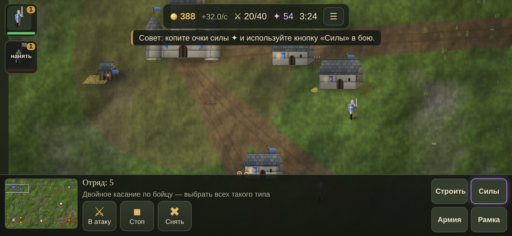
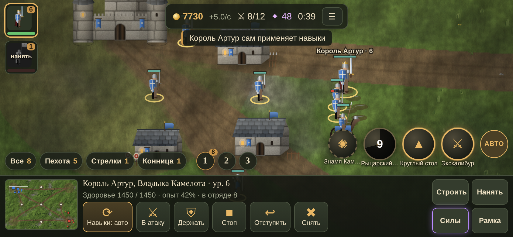

# Пепельные Королевства

Мобильная стратегия в реальном времени в духе *The Battle for Middle-earth*: шесть народов, двенадцать легендарных героев из истории и мифов, батальоны под знамёнами, три карты, кузница с улучшениями, лагеря чудовищ, смена дня и ночи, погода, генеративная музыка, сохранение битвы, бой с ИИ и онлайн через интернет.

**Графика — настоящее 3D (WebGL, three.js):** перспективная камера под наклоном, как в BFME (при приближении опускается ниже); рельеф с холмами и горами; солнце с тенями в реальном времени; вода с рябью и отражением неба; туман и дымка вдали; деревья и трава в объёме, качаются от ветра; облака бросают тени на землю; ночью светят окна, факелы и костры. Бойцы, кони, колесницы и здания — 3D-модели из примитивов с процедурными текстурами (кладка, черепица, доски, солома); бойцы поворачиваются плавно, а не в 8 сторон. Земля, скалы, кладка замков, черепица, доски, солома и кора — фотосканы [Poly Haven](https://polyhaven.com) (лицензия CC0), они подгружаются при запуске с их сервера; без интернета остаются процедурные текстуры. Поверх — кинематографическая пост-обработка: свечение огня и магии, мягкая цветокоррекция, размытие краёв кадра. При сильном приближении камера опускается к земле, как в кино: видно небо с облаками и солнцем, горизонт, над реками стелется туман, у берегов пена. Бойцы шагают плавно (12 фаз шага). Если WebGL недоступен или нет интернета для загрузки three.js, игра сама включает 2D-режим. Переключатель «Графика: 3D / 2D» есть в главном меню и в паузе.



## Как играть

**Играть онлайн:** https://facei7505-droid.github.io/LOTR/ · **Галерея моделей:** https://facei7505-droid.github.io/LOTR/gallery.html

Или откройте `index.html` в браузере телефона или компьютера. Установка не нужна. Лучше играть в горизонтальной ориентации. Большие сгенерированные модели загружаются только с сервера (по ссылке выше), из локального файла видны только встроенные.

- **Цель:** разрушить цитадель противника.
- **Батальоны:** войска нанимаются отрядами по 5–12 бойцов со знаменосцем. Батальон ходит строем (ближний бой впереди, стрелки сзади), дерётся вместе, становится ветеранским (★) и пополняется рядом со своими зданиями.
- **Карты:** «Речная долина» (река с мостами, вброд вдвое медленнее, остров в центре), «Горный перевал» (скалы и узкие проходы), «Снежные холмы» (замёрзшие озёра и ельник). Войска сами ищут путь в обход скал, лесов и зданий.
- **Лагеря:** волки, разбойники и тролли охраняют сундуки с золотом (+400). Разбитый лагерь через 4 минуты занимают снова.
- **Мир:** день сменяется ночью (факелы, костры, освещённые окна), идут дождь с грозой, туман и снег. Павшие остаются на поле, взрывы оставляют воронки, от зданий — руины, армии протаптывают тропы.
- **Сохранение:** битва сохраняется раз в минуту и при сворачивании; «Продолжить битву» в главном меню.
- **Экономика:** фермы дают золото и +25 к лимиту армии (не больше 300 бойцов, в сети — 120). Семь аванпостов (флаги на карте) дают +4 золота/с и +10 к лимиту.
- **Иконки и портреты:** все кнопки кольца команд, книги сил и снаряжения — рисованные медальоны (мечи, латы, огненные стрелы, знамёна, стены, требушет, сундук, зелья…); герои показаны крупным планом лица, воины — погрудными портретами.
- **Галерея моделей** (`gallery.html`, кнопка в главном меню): все герои, войска и здания шести народов на подиуме — вращение, шаг/удар/гибель, клинки и броня из кузни, цвет команды, каркас и число треугольников. Режим «Детали» (и качество «Ультра» в игре) добавляет наплечники из пластин, наколенники, поножи, пояс с пряжкой, брови и уши.
- **Герои** растут до 10 уровня и открывают навыки на 1, 2, 4 и 6 уровне. Павшего героя можно воскресить за полцены.
- **Силы народа** копятся за победы: лечение армии, подкрепление, удар с неба.

## Снаряжение, крепость, уровни, реликвии

- **Снаряжение (как в BFME2):** в казарме открываются кованые клинки, тяжёлая броня и знаменосец, на стрельбище — огненные стрелы (клинкам, броне и стрелам нужна кузница). Потом снаряжение покупается каждому батальону отдельно — кнопками в его кольце команд.
- **Улучшения цитадели:** каменные стены (+50% прочности), лучники на стенах (три цели сразу), требушет (камни по скоплениям врагов), казна (+3 золота/с), лазарет (лечение рядом с цитаделью).
- **Уровни батальонов:** за убийства батальон растёт до 10 уровня, каждый уровень даёт +4% к урону и здоровью. На 3 уровне знаменосец становится **лидером**: он сильнее и сам возвращает павших в строй. Навык **«Знамя»** мгновенно поднимает до трёх павших и воодушевляет отряд.
- **Осадные машины:** в кузнице каждого народа строится катапульта. Она мечет камни на 500 шагов по площади и втрое сильнее бьёт по зданиям — бьёт цитадель из-за пределов её выстрелов.
- **Древние реликвии:** каждые несколько минут в центре карты появляется реликвия. Удержите её 8 секунд — +400 золота и боевой клич для всей армии.

## Тактика, настройки, онлайн-чат

- **Стойки батальонов:** «Натиск» (+20% урона, быстрее, но уязвимее) и «Стена щитов» (+20% брони, медленнее) — кнопка в круге команд.
- **Фланги и тыл:** удар в ближнем бою во фланг +15%, в тыл +30%. **Таран конницы:** на скаку всадники сбивают пехоту и стрелков, копейщики останавливают их.
- **Особый вид улучшений:** кованые клинки искрят, тяжёлая броня даёт латы с гребнем цвета команды, стрелы у каждого народа свои — огненные, звёздные, рунные, ядовитые, солнечные. У каждого героя своя аура.
- **Кампания «Пепел Камелота»:** шесть сюжетных миссий с брифингами — от стычки на реке и обороны стен до союза с эльфами и битвы с Мордредом. Миссии открываются по очереди.
- **Артефакты героев** (как в Warcraft III): разбитый лагерь чудовищ и реликвия дают ближайшему герою артефакт — кольцо ярости, мифриловую кольчугу, сапоги, перо феникса, амулет жизни или корону мудреца. До трёх на героя, остаются после воскрешения.
- **Стены и ворота** (как в BFME2): строитель ставит стену двумя касаниями — начало и конец. Длинная стена получает ворота: свои проходят, враги упираются и ломают. Секции растут сами, строители ускоряют.
- **Режим «Выживание»:** 15 волн орды идут на вашу цитадель, каждая пятая — с вождями (тролли, вражеский герой). За отбитую волну — золото. Можно играть онлайн вместе против орды. После битвы — график армий.
- **Туман войны** (как в Age of Empires и Warcraft III): неразведанная земля тёмная, разведанная приглушена, враги видны только рядом с вашими войсками; башни и герои видят дальше. Включается в меню битвы.
- **Облик героев:** крылья у Исиды и Фрейи, ореолы у Жанны, Артемиды и Хель, пылающее оружие у Кухулина, Ареса и Анубиса. Кованые клинки у бойцов светятся цветом своего народа.
- **Живой мир:** стаи птиц над полем, олени у лесов убегают от армий.
- **Настройки:** 2D/3D, качество (низкое — ультра), громкость, скорость камеры, счётчик FPS.
- **Онлайн:** чат в лобби и в битве (быстрые фразы), выбор карты хостом, 20 секунд на переподключение перед заменой игрока ИИ.

## Модели

Король Артур (King), орк-невольник (Orc) и цитадель людей (Castle Fortress) — модели [Quaternius](https://quaternius.com) с [Poly Pizza](https://poly.pizza), лицензия CC0. Лежат в `assets/` и встраиваются в `index.html` при сборке; анимации запекаются в кадры (стоит, шаг, удар, падение), поэтому сотни бойцов не тормозят.

## Народы и герои

| Народ | Герой-воин | Герой-маг |
|---|---|---|
| Люди (Камелот) | Король Артур | Жанна д'Арк |
| Эльфы (Сильваэн) | Кухулин | Артемида |
| Гномы (Громгард) | Тор | Фрейя |
| Орки (Чёрный Клык) | Арес | Кощей Бессмертный |
| Нежить (Легион Мёртвых) | Мордред | Хель |
| Кемет (пустынное царство) | Анубис | Исида |

У каждого народа 4 типа батальонов: пехота, копейщики, стрелки и конница. Копья бьют конницу, конница бьёт стрелков, стрелки бьют пехоту. У орков батальоны больше и дешевле, у гномов меньше, но в тяжёлой броне. Нежить — многочисленные скелеты, костяные лучники и рыцари смерти на чёрных конях. Кемет — хопешники, стража Нила, лучники Сета и боевые колесницы.

## Строители, книга сил и панель как в BFME

- **Строители** возводят и чинят здания. Нажмите на строителя — справа выедут объёмные здания на выбор. Стройка идёт, только пока рядом работают строители. Цитадель не чинится.
- **Книга сил ✦** над мини-картой: за победы, аванпосты и лагеря копятся очки. Древо из 9 сил в 4 ярусах (от лечения и золота до ультимативной силы народа). Изученные силы стоят колонкой слева.
- **Панель**: круглая мини-карта, вокруг неё золото, лимит армии и время; рядом круг команд с портретом выбранного в центре. Удержание кнопки — подсказка.

## Управление (телефон)



- **Касание:** выбрать батальон целиком; касание по земле — идти в атаку строем; касание по врагу — атаковать.
- **Удержание и ведение пальцем:** рамка выделения. **Два пальца:** зум и прокрутка.
- **Внизу слева:** «Все», «Пехота», «Стрелки», «Конница». Кнопки **1–3** — отряды: удерживайте кнопку, чтобы сохранить отряд.
- **Справа:** кнопки навыков героя видны всегда, даже если герой не выделен. Касание — выбрать цель, **двойное касание — умный удар** по самой плотной группе врагов, удержание — описание навыка. «АВТО» — герой сам применяет навыки.
- **«Нанять»:** найм батальона из любого здания. **«Пополнить»**, **«Держать строй»**, **«Отступить»**, **«Марш»**.
- **Мини-карта:** касание — камера, двойное касание — отправить войска.

**ПК:** ПКМ — приказ, колесо — зум, ЛКМ с протяжкой — рамка, 1–4 — навыки, Q — вся армия, WASD — камера.

## Онлайн

«Онлайн с друзьями» работает из любой копии игры, где есть интернет (GitHub Pages, файл на телефоне). Лобби идёт через публичный MQTT-сервер по WebSocket (broker.emqx.io, запасные — HiveMQ и test.mosquitto.org). Комната `public` общая для всех игроков; свой код комнаты позволяет играть только с друзьями. Хост считает игру и рассылает снимки состояния, гости отправляют приказы. Если игра опубликована как артефакт на claude.ai, используется комната платформы.

Публичный сервер не требует регистрации, но и не защищён: не пишите в имени личных данных.

## Структура

```
src/data.js     народы, войска, здания, герои, навыки, силы
src/engine.js   батальоны и строй, бой, экономика, навыки, кузница, лагеря, сохранение, снимки для сети
src/map.js      три типа карт: вода, скалы, дороги, леса, лагеря, сетка проходимости и поиск пути (A*)
src/audio.js    синтезированные звуки боя, погоды и генеративная музыка для каждого народа
src/ai.js       ИИ-противник
src/net.js      сетевой транспорт и сжатие снимков
src/r3d.js      софт-рендерер: трассировка лучей по сферам, капсулам, многогранникам, свет и тени
src/models.js   3D-модели бойцов, коней, чудовищ и их анимации; фоновое запекание спрайтов
src/buildings3d.js 3D-модели крепостей и построек для каждого народа
src/render.js   2D-сцена (запасной режим): земля из текстурных тайлов, тени, тела и воронки, свет, погода, мини-карта
src/render3d.js 3D-сцена на three.js: рельеф, вода, леса, трава, тени, частицы, камера, метки на земле
src/assets3d.js загрузка glTF-моделей, запекание анимаций в кадры
assets/         скачанные модели (CC0)
src/main.js     интерфейс, управление, меню, лобби, игровой цикл
src/shell.html  разметка и стили интерфейса
build.sh        сборка в index.html и dist/artifact.html
tests/          автотесты (Node + Playwright)
```

## Сборка и тесты

```bash
./build.sh                  # собрать index.html
node tests/simtest.js       # бои ИИ против ИИ за все расы
node tests/engtest.js       # движок: стройка, найм, силы, герои, сохранение, сеть — для всех шести народов
node tests/movetest.js      # плавность марша батальонов и застревания в лесах и у скал
node tests/pwtest.js        # сценарий на экране телефона
node tests/uitest.js        # проверка сенсорного управления
node tests/nettest.js       # онлайн: хост и гость в двух вкладках
```

Для тестов в браузере нужен `playwright`.

## Сгенерированные 3D-модели

Реалистичные модели делаются в Tripo3D или Meshy по промптам (для каждого юнита, героя и здания свой промпт, имя файла и бюджет полигонов).

1. Файл называется ключом юнита или здания: `hum_inf.glb`, `elf_h1.glb`, `dwf_barr.glb`. Оружие и щит — `hum_inf_weapon.glb`, `hum_inf_shield.glb`. Анимации отдельными файлами — `hum_inf_idle.glb`, `_walk`, `_attack`, `_death`.
2. Файл кладётся в `assets/`. `bash build.sh` сам сжимает новые модели под бюджет (`tools/optimize-models.mjs`, нужен один раз `npm install`): упрощает сетку, переводит текстуры в WebP, оригинал откладывает в `assets/src/`.
3. Модель сама заменяет процедурную; королевский синий `#1F4FBF` на ткани перекрашивается в цвет команды. Проверить — в `gallery.html`.

